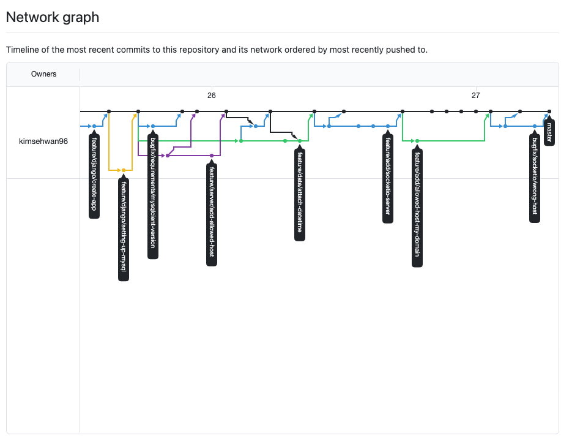

# iot 과제 제출을 위한 레포

- 백엔드 프레임워크
    - Django
- 프론트
    - Bootstrap

- 그 외
    - mqtt broker

- 배포 과정
    - ec2
        - git pull origin master

- 개발 과정
    - feature branch 전략.


- 개발 완료 후 브랜치 상태.

링크

http://sehwanzzang.com:8000/mainApp/

### 기획서

#### S/W Flow chart


#### H/W Flow char


## firt step

- 새로운 파이썬 가상환경 생성
    - `virtualenv venv --python=python3`
    - venv라는 이름의 가상환경 생성
    - `python3 -m pip freeze > requirements.txt` 이용하여
    - 이 프로젝트에 필요한 requirements.txt 를 뽑아낸다.

### 작업 방법

- django 개발 서버가 뜰 때, flask-socketio 서버를 스레드 분리한다.
- 이놈은 9999번 포트 쓸 것임.
- 웹 프론트 페이지에서  localhost:9999번과 socketio 사용해서 실시간 데이터 출력 할 예정 (아주 원시적인...)
- 참 어렵다

### 아두이노는 다음과 같이 데이터를 20초 주기로 올린다.

```json
{
    "temp" : 24.5,
    "humid" : 42,
}
```

- ardu.py는 다음과 같은 역할을 수행한다.
    - mqtt client와 커넥션 맺는다.
    - 받은 데이터를 MySQL에 꽂아준다.
    - 동시에 class 내 buffer에 해당 데이터를 갖고있는다

- socketio 요청이 들어오면 ardu.py 안의 클래스에 있는 buffer의 값을 읽어 웹으로 보내준다.

### 끝 !!!!!!


- 메인 화면
    - socketio를 통해 실시간 mqtt를 통해 들어온 (esp8266으로부터) 받은 값을 보여준다.


- 데이터 저장 확인 화면
    - mysql에 실시간 데이터 저장중.
        - django의 여러 기능을 활용하여 리스트 형태로 뽑아냄


- 데이터를 클릭하면 세부 화면 확인 가능

### esp8266 그림


- 여기 달려있는 DHT22로부터 받는다.

```cpp
#include <ESP8266WiFi.h>
#include <PubSubClient.h>
#include <SimpleDHT.h>
#include <string.h>

const char* ON = "On";
const char* OFF = "Off";

const char* ssid = "U+Net2469";
const char* password = "1000003757";
const char* mqtt_server = "3.34.87.77";

int pinDHT22 = 14;
SimpleDHT22 dht22(pinDHT22);
float temperature = 0;
float humidity = 0;

WiFiClient espClient;
PubSubClient client(espClient);
unsigned long lastMsg = 0;
#define MSG_BUFFER_SIZE (50)
char msg[MSG_BUFFER_SIZE];
int value = 0;

void setup_wifi() {
    delay(10);
    Serial.println();
    Serial.print("Connecting to");
    Serial.println(ssid);
    WiFi.mode(WIFI_STA); // station 모드
    WiFi.begin(ssid, password);

    while (WiFi.status() != WL_CONNECTED){
        delay(500);
        Serial.print(".");
    }
    Serial.println("");
    Serial.println("WiFi Connected");
    Serial.println("IP address :");
    Serial.println(WiFi.localIP());
}

void callback(char* topic, byte* payload, unsigned int length) {
    char msg[length];
    Serial.print("Message arrived [");
    Serial.print(topic);
    Serial.print("] : ");
    //동작한다
    for(int i = 0; i < length; i++) {
        msg[i] = (char)payload[i];
    }
    Serial.println(msg);
    if (strcmp(msg, ON)==0){
        Serial.println("On message got");
    }
    //
}

//커넥션 끊어 졌을 때 
void reconnect() {
    while (!client.connected()) {
        Serial.print("Attemp MQTT Conn");
        //create random client id
        String clientId = "ESP8266Client-";
        clientId += String(random(0xffff), HEX);

        if (client.connect(clientId.c_str())) {
            Serial.println("conn");
            client.publish("2015146007/conn", "conn sucess");
            client.subscribe("2015146007/inTopic");
        } else {
            Serial.print("failed, rc=");
            Serial.print(client.state());
            delay(5000);
        }
    }
}

void get_dht22() {
    int err = SimpleDHTErrSuccess;
    if ((err = dht22.read2(&temperature, &humidity, NULL)) != SimpleDHTErrSuccess) {
        Serial.print("Read DHT22 failed, err="); Serial.println(err); delay(2000);
        return;
    }
}

void setup() {
    pinMode(16, OUTPUT);
    Serial.begin(115200);
    setup_wifi();
    client.setServer(mqtt_server, 1883);
    client.subscribe("2015146007/inTopic");
    client.setCallback(callback);//setCallback 구현 당시에 callback함수의 인자로
    // void callback(char* topic, byte* payload, unsigned int length) 미리 정의가 된 것?
}

void loop() {
    if (!client.connected()) {
        reconnect();
    }
    client.loop();
    unsigned long now = millis();

    if (now - lastMsg > 60000) {//1분마다 한번씩 송신
        lastMsg = now;
        ++value;
        get_dht22();
        snprintf(msg, MSG_BUFFER_SIZE, "{ \"temp\" : %2.f, \"humid\" : %.2f }", temperature, humidity, value);
        //Serial.print("publish message: ");
        //Serial.println(msg);
        client.publish("2015146007/DHT22", msg);
    }
}
```


### 장고 코드는 깃헙에

- 제일 중요한 코드
    - <strong> __init__.py</strong>
```python3
#socketio 를 활용해서
#django 서버가 socketio까지 뿌리고
#html에서는 socketio recv해서 Dom을 직접 조작해서 보여주자..
#테스트해보자
from logging import debug
from time import sleep
from flask import Flask
from flask_socketio import SocketIO, emit
from time import sleep
from flask_cors import CORS
from .ardu import Arduino

# import multiprocessing as mp
# from multiprocessing import Array #for IPC shared memory

from threading import Thread

async_mode = None #for buffer flushing
app = Flask(__name__) 
app.config['SECRET_KEY'] = 'secret!'
socketio = SocketIO(app, async_mode=async_mode, cors_allowed_origins='*', port=9999)
CORS(app)

shared_list = [0, 0]
print(shared_list)

ard = Arduino(shared_list)
th2 = Thread(target=ard.run, daemon=True)

@app.route("/")
def index():
    return ("Invaild Path")

@socketio.on('request', namespace='/data')
def push_values(msg):
    emit('rtdata', {'data':ard.get_data()})

#데몬 프로세스 하나 생성 -> socketio 서버 런
th1 = Thread(target=socketio.run, args=(app,), kwargs =  {"debug" :False, "port": 9999},
daemon=True)


th1.start()
th2.start()


print("__init__ has done")
```

### mqtt를 이용하여 esp8266으로부터 데이터를 수집하는 코드.

```python3
import random
from paho.mqtt import client as mqtt_client
from .DAO import DataDAO
from datetime import datetime
import json
from time import sleep
class Arduino:
    def __init__(self, shared_list):
        self.broker = '3.34.87.77'
        self.port = 1883
        self.input_topic = "2015146007/DHT22"
        self.client_id = f'python-mqtt-{random.randint(0, 100)}'
        self.client = None
        self.dao = DataDAO()
        self.temp = None
        self.humid = None
        self.shared_list = shared_list

    def connect_mqtt(self) -> mqtt_client:
        def on_connect(client, userdata, flags, rc):
            if rc == 0:
                print("Connected to MQTT Broker!")
            else:
                print("Failed to connect, return code %d\n", rc)
        client = mqtt_client.Client(self.client_id)
        client.on_connect = on_connect
        client.connect(self.broker, self.port)
        return client
    
    def subscribe(self, client: mqtt_client):
        def on_message(client, userdata, msg):
            #print(f"Received `{msg.payload.decode()}` from `{msg.topic}` topic")
            recv = msg.payload.decode()
            jd = json.loads(recv)
            if jd:
                temp = jd.get('temp')
                humid = jd.get('humid')
                self.temp =  temp
                self.humid = humid
                print("this is got : {}".format(jd))
                self.dao.insert_data(temp, humid)
            else:
                print("no data...")

        client.subscribe(self.input_topic)
        client.on_message = on_message

    def run(self):
        self.client = self.connect_mqtt()
        self.subscribe(self.client)
        self.client.loop_start()
        print('ardu process start to run')
        self.get_data()

    def get_data(self):
        if ( (self.temp == None) & (self.humid == None)):
            return [0, 0]
        else:
            return [self.temp, self.humid]
```

### 수집한 데이터를 mysql에 저장하는 코드

```python3
from time import time
import MySQLdb
import traceback
from datetime import datetime

class DataDAO:
    def __init__(self):
        #기초 정보를 셋업함
        self.host = "3.34.87.77"
        self.username = "root"
        self.password = "j112189"
        self.database = "iot_db"
        self.temp = None
        self.timestamp = None
        self.humid = None
    
    
    def get_conn(self):
        db = MySQLdb.connect(user=self.username,
        host=self.host, passwd=self.password, db=self.database)

        return db

    def get_cursor(self, connection):
        return connection.cursor()

    def insert_data(self, temp, humid):
        self.temp = temp
        self.humid = humid
        self.timestamp = datetime.now()
        print("this is now ! {}".format(self.timestamp))
        con = self.get_conn()
        cursor = self.get_cursor(con)

        query = """
        INSERT INTO mqttApp_data(timestamp, temp, humid) VALUES(%s ,%s, %s)
        """
        print(str(self.temp), str(self.humid))
        try:
            cursor.execute(query, (self.timestamp.strftime("%Y-%m-%d %H:%M:%S"), self.temp, self.humid))
            con.commit()
        except Exception as e:
            print(traceback.format_exc())
            cursor.close()
        finally:
            cursor.close() #cursor를 커밋 이후 close한다.
            self.temp = None
            self.humid = None 


if __name__=="__main__":
    d = DataDAO()
    d.insert_data(10.5, 67.9)

```

- 위 코드는 mysql에 mqtt로 받은 데이터를 저장하는 코드이며
- ardu.py 코드에서 이 코드 중 `insert_data()` 함수를 호출하여 데이터를 실시간으로 저장하게 된다.


